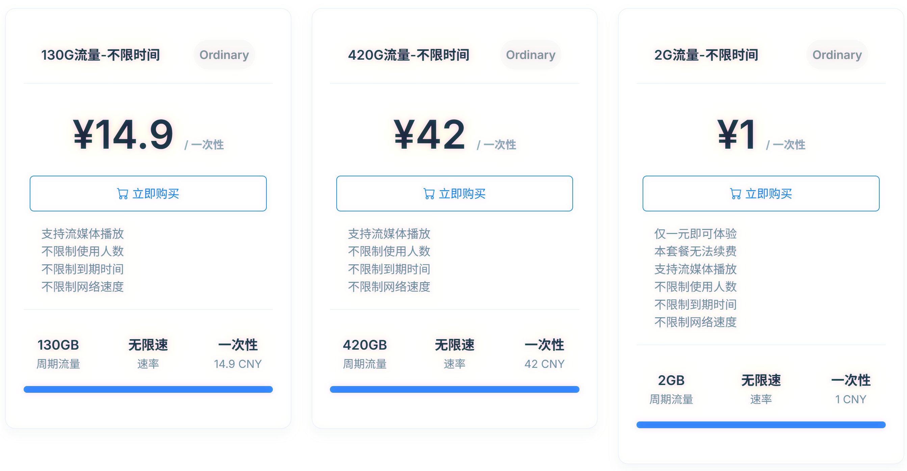

# 🚀 免费机场 免费梯子 | 每6小时更新 | Clash/V2Ray 免费节点订阅 🔥

⭐ 每天 4 次自动更新 | 🌐 4 个稳定订阅源 | 📱 全平台支持 | 💯 完全免费 | 🎯 科学上网 | 🔓 翻墙VPN

> **免费节点、clash订阅链接、v2ray订阅、clash科学上网、免费clash节点、免费梯子、clash教程、clash for windows、免费公益节点、最新免费节点订阅地址每日更新**

---

## ✨ 特色功能

- 🔄 **每 6 小时自动更新** - GitHub Actions 定时抓取最新免费节点，自动替换失效节点
- 🎯 **4 个稳定订阅源** - 多源备份，自动回退机制，clash/v2ray 双协议支持
- 📱 **全平台客户端支持** - Windows/macOS/Android/iOS/Linux 全覆盖
- 🆓 **完全免费公益** - 无需注册，无需付费，免费梯子直接使用
- 🚀 **一键订阅翻墙** - 复制订阅链接粘贴即可，小白也能轻松科学上网
- 🌏 **CDN 加速** - jsDelivr 全球 CDN，国内访问更快更稳定

---

## 🚀 快速开始 - 三步轻松翻墙

### 新手教程：三步即可科学上网

**1️⃣ 下载客户端** - 从下面表格选择适合你系统的 Clash 或 V2Ray 客户端**2️⃣ 复制订阅链接** - 选择任意 CDN 订阅源（源 1/2/3）**3️⃣ 导入订阅** - 粘贴到客户端的「订阅管理」或「配置」中

> 💡 **首次使用？** 查看 [iOS 详细教程](iOS-TUTORIAL.md) | 不懂如何使用 Clash？参考 clash for windows 教程
> 🎬 **视频教程**：[Clash 使用教程](https://www.youtube.com/results?search_query=clash+%E4%BD%BF%E7%94%A8%E6%95%99%E7%A8%8B) | [V2Ray 使用教程](https://www.youtube.com/results?search_query=v2ray+%E4%BD%BF%E7%94%A8%E6%95%99%E7%A8%8B)

---

## 📱 Clash/V2Ray 客户端下载

| 平台              | Clash 客户端                                                                                                                                            | V2Ray 客户端                       |
| ----------------- | ------------------------------------------------------------------------------------------------------------------------------------------------------- | ---------------------------------- |
| **Windows** | [Clash Mi](https://clashmi.app/download) / [Clash Verge Rev](https://www.clashverge.dev/install.html) / [FlClash](https://github.com/chen08209/FlClash/releases) | [v2rayN](https://v2rayn.2dust.link)   |
| **macOS**   | [Clash Mi](https://clashmi.app/download) / [Clash Verge Rev](https://www.clashverge.dev/install.html) / [FlClash](https://github.com/chen08209/FlClash/releases) | [v2rayN](https://v2rayn.2dust.link)   |
| **Android** | [Clash Mi](https://clashmi.app/download) / [FlClash](https://github.com/chen08209/FlClash/releases)                                                           | [v2rayNG](https://v2rayng.2dust.link) |
| **iOS**     | [Clash Mi](https://clashmi.app/download) / [Stash](https://apps.apple.com/app/stash/id1596063349)                                                             | [V2Box（免费）](iOS-TUTORIAL.md)      |
| **Linux**   | [Clash Mi](https://clashmi.app/download) / [Clash Verge Rev](https://www.clashverge.dev/install.html) / [FlClash](https://github.com/chen08209/FlClash/releases) | [v2rayN](https://v2rayn.2dust.link)   |

---

## 📡 免费订阅地址（clash订阅链接 | v2ray订阅链接）

### 🎨 Clash 免费订阅链接

> 把下面任意一个 clash 订阅链接复制到 Clash 客户端（Clash for Windows、ClashX、Clash Meta 等）的「订阅」或「配置」中
>
> 💡 **推荐使用 CDN 链接**（更快更稳定），支持科学上网、翻墙，如遇问题可切换到 GitHub 原始链接

<table>
<tr>
<td width="80"><b>源 1 CDN</b></td>
<td><code>https://cdn.jsdelivr.net/gh/JerryLiu369/free_tizi@main/subscriptions/clash1.yaml</code></td>
</tr>
<tr>
<td><b>源 2 CDN</b></td>
<td><code>https://cdn.jsdelivr.net/gh/JerryLiu369/free_tizi@main/subscriptions/clash2.yaml</code></td>
</tr>
<tr>
<td><b>源 3 CDN</b></td>
<td><code>https://cdn.jsdelivr.net/gh/JerryLiu369/free_tizi@main/subscriptions/clash3.yaml</code></td>
</tr>
<tr>
<td><b>源 4 CDN</b></td>
<td><code>https://cdn.jsdelivr.net/gh/JerryLiu369/free_tizi@main/subscriptions/clash4.yaml</code></td>
</tr>
</table>

📦 <b>GitHub 原始链接（备用）</b>

| 源   | 链接                                                                                       |
| ---- | ------------------------------------------------------------------------------------------ |
| 源 1 | `https://raw.githubusercontent.com/JerryLiu369/free_tizi/main/subscriptions/clash1.yaml` |
| 源 2 | `https://raw.githubusercontent.com/JerryLiu369/free_tizi/main/subscriptions/clash2.yaml` |
| 源 3 | `https://raw.githubusercontent.com/JerryLiu369/free_tizi/main/subscriptions/clash3.yaml` |
| 源 4 | `https://raw.githubusercontent.com/JerryLiu369/free_tizi/main/subscriptions/clash4.yaml` |

### 🛰️ V2Ray 免费订阅链接

> 把下面任意一个 v2ray 订阅链接复制到 V2Ray 客户端（v2rayN、v2rayNG、V2Box 等）的「订阅管理」中
>
> 💡 **推荐使用 CDN 链接**（更快更稳定），支持科学上网、免费翻墙，如遇问题可切换到 GitHub 原始链接

<table>
<tr>
<td width="80"><b>源 1 CDN</b></td>
<td><code>https://cdn.jsdelivr.net/gh/JerryLiu369/free_tizi@main/subscriptions/v2ray1.txt</code></td>
</tr>
<tr>
<td><b>源 2 CDN</b></td>
<td><code>https://cdn.jsdelivr.net/gh/JerryLiu369/free_tizi@main/subscriptions/v2ray2.txt</code></td>
</tr>
<tr>
<td><b>源 3 CDN</b></td>
<td><code>https://cdn.jsdelivr.net/gh/JerryLiu369/free_tizi@main/subscriptions/v2ray3.txt</code></td>
</tr>
<tr>
<td><b>源 4 CDN</b></td>
<td><code>https://cdn.jsdelivr.net/gh/JerryLiu369/free_tizi@main/subscriptions/v2ray4.txt</code></td>
</tr>
</table>

📦 <b>GitHub 原始链接（备用）</b>

| 源   | 链接                                                                                      |
| ---- | ----------------------------------------------------------------------------------------- |
| 源 1 | `https://raw.githubusercontent.com/JerryLiu369/free_tizi/main/subscriptions/v2ray1.txt` |
| 源 2 | `https://raw.githubusercontent.com/JerryLiu369/free_tizi/main/subscriptions/v2ray2.txt` |
| 源 3 | `https://raw.githubusercontent.com/JerryLiu369/free_tizi/main/subscriptions/v2ray3.txt` |
| 源 4 | `https://raw.githubusercontent.com/JerryLiu369/free_tizi/main/subscriptions/v2ray4.txt` |

---

## ❓ 常见问题

<b>Q: 为什么连不上？</b>

**A:**

1. **优先使用 CDN 链接**（推荐），如果不行再试 GitHub 原始链接
2. 尝试切换其他订阅源（源 1/2/3/4）
3. 等待下次自动更新（每 6 小时更新一次）
4. 检查客户端配置是否正确
5. 如果都不行，可能是节点暂时失效，请稍后再试

<b>Q: 速度慢怎么办？</b>

**A:**

1. 免费节点速度有限，这是正常现象
2. 可尝试切换不同节点
3. 避开高峰时段（晚上 8-11 点）使用
4. 如需稳定高速，建议使用付费机场

<b>Q: 如何导入订阅？</b>

**A:**

1. 复制上面任意一个订阅链接
2. 打开你的 Clash 或 V2Ray 客户端
3. 找到「订阅管理」或「配置」
4. 粘贴链接，点击更新/导入
5. iOS 用户可查看 [详细教程](iOS-TUTORIAL.md)

<b>Q: 多久更新一次？</b>

**A:**

- GitHub Actions 每 6 小时自动运行一次
- 每天更新 4 次：00:00、06:00、12:00、18:00 (UTC+8)
- 自动抓取最新节点并替换失效节点

---

## 💳 推荐机场

如果免费节点不稳定，可以考虑付费机场。这里推荐 **Mojie（魔戒）** 机场，特色是 **一元体验** 🎉

### 套餐价格

| 流量          | 价格          | 特色                      |
| ------------- | ------------- | ------------------------- |
| **2GB** | **¥1** | 🌟 一元试用，新用户必体验 |
| 130GB         | ¥14.9        | 流媒体解锁，一次性购买    |
| 420GB         | ¥42          | 大流量套餐，一次性购买    |

**邀请码**：`oRvNpmEZ`

[👉 点击注册 Mojie 机场](https://mojie.kim/register?aff=oRvNpmEZ)
[👉 备用注册链接](https://mojie.app/register?aff=oRvNpmEZ)

---

## ⚠️ 免责声明

> 本项目仅供学习交流使用，节点源自互联网公开分享。
> 请勿用于非法用途，使用本项目所产生的一切后果由使用者自行承担。
> 项目维护者不对节点的可用性、安全性、稳定性做任何保证。

---

## 💬 交流反馈

- 📮 **问题反馈**：[提交 Issue](https://github.com/JerryLiu369/free_tizi/issues)
- ⭐ **觉得不错**：右上角点个 Star 支持一下
- 🔔 **关注更新**：Watch 本项目获取最新动态

---

## ⭐ Star History

---

**如果这个项目对你有帮助，请点个 ⭐ Star 支持一下！**

Made with ❤️ by JerryLiu369

