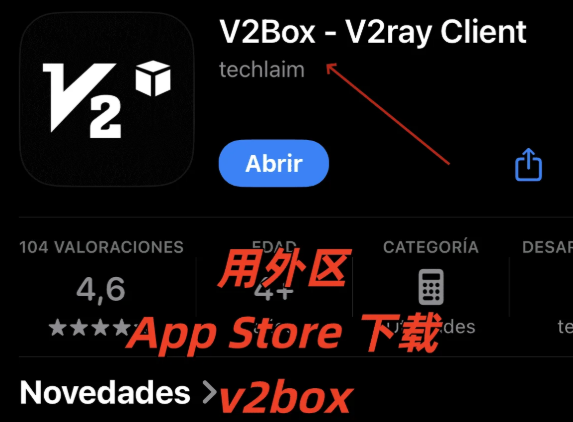
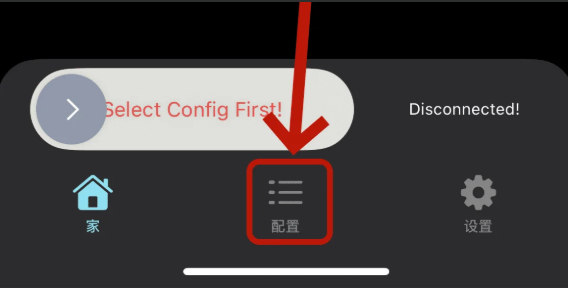
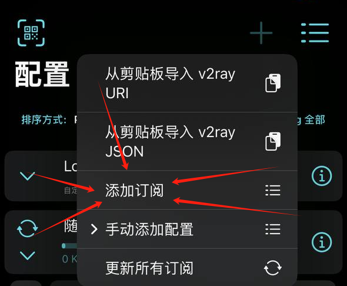
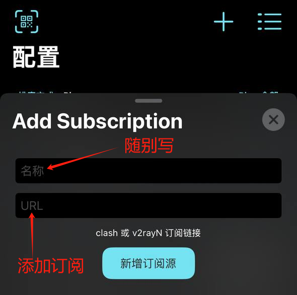
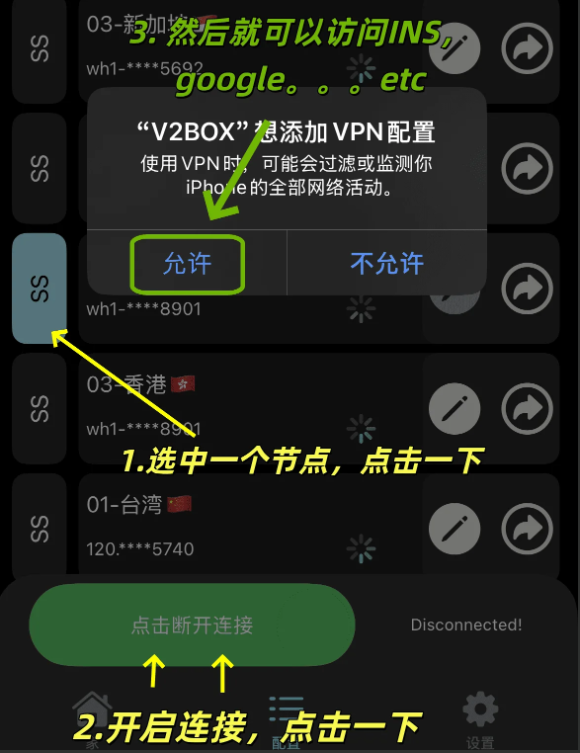

# 🚀 iOS 使用教程（V2Box）

V2Box 是一款 iOS 免费代理客户端，支持多协议，适合新手快速上手。本教程教你如何导入订阅与连接节点。

## 📚 目录

- 📥 第一步：下载 V2Box
- ➕ 第二步：点击添加配置
- 📋 第三步：从剪贴板导入订阅
- 🔗 第四步：粘贴订阅链接并填写备注
- 🟢 第五步：启动连接

---

## 📥 第一步：下载 V2Box

### ✅ V2Box（iOS / 免费 / 有广告）

下载地址：[https://apps.apple.com/us/app/v2box-v2ray-client/id6446814690](https://apps.apple.com/us/app/v2box-v2ray-client/id6446814690)

> ⚠️ 注意：需要非中国区 Apple ID 才能下载

> ⚠️ 如使用共享 Apple ID：
> - 仅登录 App Store
> - 下载后马上退出
> - 不要登录到手机系统设置中

---

## ➕ 第二步：点击添加配置

打开 V2Box → 点击「配置」，再点击右上角的「＋」

---

## 📋 第三步：从剪贴板导入订阅

点击：**添加订阅**

---

## 🔗 第四步：粘贴订阅链接并填写备注

1. 在「输入URL」框粘贴你的订阅链接（从本项目 README 复制）
2. 名称可随便写，例如「源1」或「源2」
3. 点击「新增订阅源」，确定即可
4. 如果显示节点列表代表导入成功

---

## 🟢 第五步：启动连接

回到首页：

1. 如果导入成功，请选中下方显示的任意一个节点
2. 滑动底部开关，如果第一次使用，会弹出 VPN 配置授权请求
3. 显示 **绿色** 即成功

---

## 💡 提示

- 首次使用需要授权 VPN 配置权限
- 如果连接不成功，可以尝试切换其他节点
- 订阅链接会自动更新，建议定期在 App 内刷新订阅
